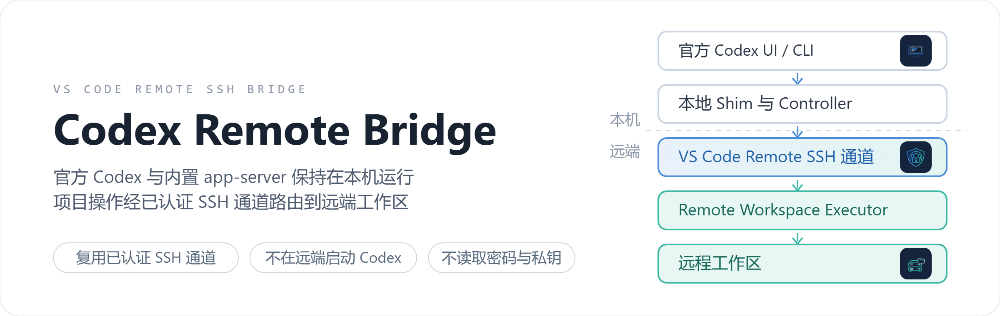

# Codex Remote Bridge

<p align="center">
  
</p>

## 概览

Codex Remote Bridge 让官方 Codex VS Code 扩展及其内置 app-server 保持在本机运行，
把经过授权的项目操作路由到当前 VS Code Remote SSH 工作区。默认链路复用 VS Code
已经建立的远程连接，不读取 SSH 密码或私钥，也不在远端启动 Codex。

- 当前源码版本为 `0.3.90` 候选；完整双平台发布门禁完成前不发布 `0.4.0`，也不扩大支持
  声明。
- 官方输入区的原生 `@` 文件搜索通过当前 Remote SSH 工作区查询；可选兼容层把 Explorer
  与系统文件管理器拖放统一转换为当前光标处的原生 `@` 引用，本机拖入项按当前 Codex
  thread 绑定为只读资源，Remote SSH 会话始终只有一个远程项目主根。
- Remote SSH 冷启动明确区分“窗口已打开”和“Remote Extension Host 已响应”，不会提前
  伪报 `ready`；普通 Controller/Shim 更新只需一次用户重载。
- 官方 Codex 与内置 Copilot Chat 固定在本机 UI Extension Host；原有扩展位置设置逐项
  备份、可恢复。
- 已取消 Bridge 自定义的资源管理器右键添加入口和远端快照附件。版本演进与验收流水见
  [文档](#文档)与 [TODO](#todo)。

## 工作原理

- Controller 是本地 `ui` 扩展，负责配置、审计、资源映射和远程 Executor 部署；Shim
  代理官方扩展内置 app-server，并为 Remote SSH thread 注入 Bridge 工具和安全策略。
- 官方扩展只配置稳定 launcher 路径；Controller 原子发布 Extension Host 代际、Shim
  路径和 SHA-256，launcher 校验后再启动对应内容寻址 Shim。
- Remote Executor 是远端 Workspace 扩展，只执行结构化、受根目录约束的操作。
- 默认 `vscode-remote` 模式复用活动 Remote SSH transport，`openssh` 仅作显式回退；
  兼容集合的版本值只用于诊断和回归触发，不作为运行时接纳条件。

### Linux 本地独立服务

Linux 本地使用统一回调入口，按 `CODEX_HOME` 隔离配置域；有历史实例时把同 thread
请求送回原实例，没有实例才启动用户级服务，`flock` 防止并发冷启动。Bridge 原样保留
`thread/queue/*`、`turn/start`、`turn/steer` 和 `turn/interrupt`，不在断线后自动重发
写请求。无客户端且无 loaded thread 持续 30 分钟后退出；服务崩溃后可校验并接回仍存
活的 native app-server。Remote SSH 与 Windows 尚未切换统一回调入口。

运行 `npm run desktop:install` 可安装共享启动器及 **ChatGPT (Shared Codex)** 入口，
并创建同名用户级覆盖；已有自定义入口先逐字节备份，卸载时恢复。经用户明确确认后，
可按 PID、启动时间及可执行文件身份核验，仅对旧桌面主进程发送 SIGTERM。真实 UI 的
长对话仍须验收。

## 主要能力

- 自动识别单根 Remote SSH 工作区；初始化时核对远端包版本，不一致时经当前 transport
  部署配套 Remote Executor 并重载。
- 远程读取、目录树、字面搜索、Git 状态和结构化命令执行；基于 SHA-256 的双端安全写入、
  精确补丁、重命名和删除。
- 运行中取消、进程组终止、有界幂等账本、断线结果查询，以及受控后台任务的启动、状态、
  增量日志和取消。
- 远程文件定位、选区、资源 URI 和 Diff 映射；每轮自动采集当前 Remote SSH 编辑器文件或
  非空选区作为 IDE 背景。
- 符合安全条件的 stdio MCP 可通过当前 VS Code Remote 通道在远端运行；本地 Codex CLI
  可附着和介入活动 VS Code Codex thread。
- 普通本地窗口按当前唯一文件工作区过滤任务列表；Remote SSH 窗口按主机和远程根隔离。
- Remote SSH 模式默认提供本机 VS Code 用户拥有的最大文件系统和进程权限（`full-access`），
  远端命令和重要写操作自动放行，不显示 Bridge 审批界面；本地结构化审计不记录敏感
  正文和凭据。
- 可选的原生 Codex 拖放接收面：把 VS Code Explorer 或系统文件管理器中的文件、目录拖入
  官方 Codex 对话区，在当前光标处生成原生 `@` 引用；本机拖入项在提交时绑定到当前
  thread，只读、不写入 `roots`、不复制到远端、不与其他对话共享。启用时 Bridge 逐项
  备份 Workbench、`product.json` 和官方 Webview 资产（带 SHA-256），升级后重新探测
  并请求一次新确认，同版本外部改写失败关闭。

## 支持边界

- 本地 Controller 目标为 Linux x64 或 Windows x64；两者必须在各自原生平台构建和验收。
- 远端目标为 VS Code Remote SSH 打开的 Linux x64 工作区。
- 自动初始化只接受当前窗口中唯一的远程工作区根，不猜测多根工作区。
- 默认模式不会建立第二条 SSH 认证链路。
- Remote SSH 对话中的本机拖入资源只支持默认 `vscode-remote` transport；显式 OpenSSH
  回退没有 Controller 本地资源通道，因此会失败关闭。
- 默认 `vscode-remote` 模式不限制本机 Core 文件和命令能力，实际边界就是本机 VS Code
  用户的操作系统权限；`workspace_*` 结构化写入仍保持 1 MiB、哈希和原子写边界。
- `remote_exec` 限制启动目录但不是远端文件系统沙箱；Remote SSH 会话固定使用本机
  `full-access`，不再显示本机路径或命令审批。
- Windows、Linux 和 OpenSSH 的构包或运行结果不能互相替代。

当前组件矩阵和已验证范围见
[兼容矩阵](https://github.com/RaraAlu/remote_codex/blob/main/docs/compatibility.md)，
完整安全说明见
[安全边界](https://github.com/RaraAlu/remote_codex/blob/main/docs/security-notes.md)。

## 安装与启动

### 安装现成 VSIX

1. 获取与本地平台匹配的 Controller VSIX（Linux x64 或 Windows x64），在扩展视图右上角
   菜单选择 `Install from VSIX...`，或在本机终端执行：

   ```bash
   code --install-extension "/absolute/path/to/codex-remote-bridge-<version>-<target>.vsix" --force
   ```

   Controller 必须安装到本机 UI Extension Host，不要在远端主机上安装。
2. 使用 VS Code Remote SSH 打开唯一一个远程工作区根目录，等待 Bridge 自动配置、部署
   Executor，并在必要时完成一次窗口重载（普通 Controller/Shim 更新最多需要这一次）。
3. 状态栏只有 Shim 进程存活且官方 app-server 完成 `initialize` 后才显示
   `Codex: local -> <host> (ready)`。
4. 运行 `Codex Bridge: Run Diagnostics`，确认远端身份、工作区根、`remote.codexInstalled=false`
   以及 `shimStarted`、`appServerInitialized` 等字段。
5. 在官方 Codex 面板创建任务，并通过日志和审计确认项目操作位于远端。

### 从源码打包并安装

在目标本机平台使用 Node.js 20 或更高版本执行 `npm ci && npm run check`（类型检查、
全部自动化测试、构建、Shim 冒烟和当前平台 VSIX 打包），然后安装当前平台产物：

```bash
# Linux x64
VERSION=$(node -p "require('./package.json').version")
code --install-extension "dist/codex-remote-bridge-${VERSION}-linux-x64.vsix" --force
```

```powershell
# Windows x64 PowerShell
$version = node -p "require('./package.json').version"
code --install-extension "dist/codex-remote-bridge-$version-win32-x64.vsix" --force
```

安装后执行一次 `Developer: Reload Window`。

### 本机最大权限与远端下载

Remote SSH 配置完成后无需额外授权：新 thread 固定为本机 `full-access` 并获得
`local-full-access` 根。需要把远端文件下载到本机时，直接给出本机绝对目标路径，模型可
组合远端 `workspace_*` 与本机文件/Shell 能力完成复制和校验。该模式等同于让当前
Remote SSH Codex 继承本机 VS Code 用户可访问的全部文件和进程能力，使用者须自行承担
误删、覆盖、凭据读取和执行任意本机命令的风险。

### 启用原生拖放

1. 扩展激活后自动检查当前 VS Code 与官方 Codex 资产；检测到兼容且尚未启用的接收面时，
   只弹出一次确认，随后自动请求所需系统文件权限（Linux 会出现 polkit 授权框），补丁
   成功后由用户手动重载。拒绝后不会重复打扰，可从命令面板执行
   `Codex Bridge: Enable Native Codex Drop Surface` 重试。VS Code 或官方 Codex 升级后
   会重新探测并请求一次新确认；无法证明属于升级的哈希或代码形状变化会拒绝修改。
2. 把文件、目录直接拖入官方 Codex 对话区域，所有 Bridge 捕获的拖放都在当前 Composer
   光标处生成一个原生 `@` 引用，不需要按 `Shift`。
3. 本机资源先暂存，只有在对应用原生 `@` 随 turn 提交时才绑定到该 Codex thread；均为
   只读，不写入 `roots`、不复制到远端、不与其他对话共享。
4. 删除 Codex 对话会同步清理该 thread 的资源绑定。停用或卸载前先执行
   `Codex Bridge: Disable Native Codex Drop Surface`，校验并恢复受管资产。

关闭 `codexRemoteBridge.autoInitialize` 后可用 Configure 和 Start 命令手动控制；
停用前应执行 `Codex Bridge: Restore Official Codex Settings`。Bridge 还会把
`openai.chatgpt` 与内置 `GitHub.copilot-chat` 固定到本机 UI Extension Host，两项
`remote.extensionKind` 原值分别备份，恢复时不覆盖其他扩展的映射。

## 常用命令

| 命令                                              | 用途                               |
| ------------------------------------------------- | ---------------------------------- |
| `Codex Bridge: Configure Current Remote`          | 保存当前 Remote SSH 主机和工作区根 |
| `Codex Bridge: Start`                             | 启动或重新连接 Bridge              |
| `Codex Bridge: Stop`                              | 停止当前 Bridge 会话               |
| `Codex Bridge: Run Diagnostics`                   | 显示脱敏后的组件、连接和能力状态   |
| `Codex Bridge: Show Audit Log`                    | 打开本地审计日志                   |
| `Codex Bridge: Add Remote File to Next Turn`      | 为下一轮显式加入当前远程文件       |
| `Codex Bridge: Add Remote Selection to Next Turn` | 为下一轮显式加入当前远程选区       |
| `Codex Bridge: Enable Automatic CLI Integration`  | 启用本地 Codex CLI 自动附着        |
| `Codex Bridge: Disable Automatic CLI Integration` | 停用 CLI 集成并恢复托管入口        |
| `Codex Bridge: Restore Official Codex Settings`   | 恢复 Bridge 接管前的官方设置       |
| `Codex Bridge: Enable Native Codex Drop Surface`  | 启用 Codex 面板原生拖放接收面      |
| `Codex Bridge: Disable Native Codex Drop Surface` | 校验并恢复原始 Workbench 资产      |

## 主要设置

| 设置                                      | 默认值          | 说明                                       |
| ----------------------------------------- | --------------- | ------------------------------------------ |
| `codexRemoteBridge.autoInitialize`        | `true`          | 单根 Remote SSH 窗口自动配置和连接         |
| `codexRemoteBridge.connectionMode`        | `vscode-remote` | 使用 VS Code transport 或显式 OpenSSH 回退 |
| `codexRemoteBridge.remoteMcpRouting`      | `auto`          | 自动路由合格 stdio MCP，或全部保留本机     |
| `codexRemoteBridge.remoteMcpAccess`       | `enabled`       | 保留现有 MCP 策略；`all` 为显式宽权限模式  |
| `codexRemoteBridge.commandTimeoutMs`      | `120000`        | 单次远程操作超时                           |
| `codexRemoteBridge.maxOutputBytes`        | `10485760`      | 每个远程输出流的最大捕获字节数             |
| `codexRemoteBridge.connectTimeoutSeconds` | `10`            | OpenSSH 连接超时                           |
| `codexRemoteBridge.sshExecutable`         | `ssh`           | OpenSSH 回退使用的本地客户端               |
| `codexRemoteBridge.externalCliExecutable` | `codex`         | 外部 CLI 集成使用的本地 Codex 入口         |

`remoteMcpAccess=all` 会在当前 Remote SSH app-server 进程中尝试启用通过校验的 MCP，
清空其禁用工具列表并将默认工具审批设为允许；可能开放具有副作用的工具，仅应在信任
全部相关服务时使用。

## CLI 介入

启用自动 CLI 集成后，无参数 `codex` 只会自动附着工作目录与当前目录完全一致的活动
VS Code thread；没有匹配会话时透传官方 Codex CLI。同一目录存在多个匹配会话时失败
关闭，可使用 `codex-vscode --session-pid <pid>` 显式选择。

Windows 只在 PATH 解析到同一 npm 目录中的 `codex`、`codex.cmd` 和 `codex.ps1` 时接管
完整 wrapper 集合，原始文件以相邻隐藏备份保存；npm 覆盖 wrapper 后，下一次扩展初始
化会刷新备份并恢复接管。显式入口为 `%LOCALAPPDATA%\codex-remote-bridge\bin\codex-vscode.exe`。

介入能力包括列出对话、读取完整 turn、发起新 turn 或 steer，以及中断运行中的 turn。
已启动的旧 CLI 进程不能热切换 app-server；停用集成后也应重新启动 CLI。

## 文档

- [实施状态](https://github.com/RaraAlu/remote_codex/blob/main/docs/implementation-status.md)
- [兼容矩阵](https://github.com/RaraAlu/remote_codex/blob/main/docs/compatibility.md)
- [安全边界](https://github.com/RaraAlu/remote_codex/blob/main/docs/security-notes.md)
- [升级跟进与发布门禁](https://github.com/RaraAlu/remote_codex/blob/main/docs/upgrade-tracking.md)
- [人工验收记录](https://github.com/RaraAlu/remote_codex/blob/main/docs/manual-acceptance-backlog.md)
- [验收记录目录](https://github.com/RaraAlu/remote_codex/tree/main/docs/acceptance)
- [0.3.0 系列历史 README](https://github.com/RaraAlu/remote_codex/blob/main/docs/archive/README-0.3.0.md)

根 README 只描述当前产品、当前支持边界和活动 TODO。版本演进、历史计划、验收流水和
关闭的待办保存在不可覆盖的归档与验收文档中。

## TODO

- `0.3.90` 自动编辑器上下文越界修复已在 Linux Remote SSH 实机完成首条消息和
  远端项目操作验证；当前项目内的自动上下文也已成功附加。剩余退出条件是实机
  显式越界拒绝、完整发布指标与 Windows x64 原生构建和运行验证；完整发布门禁
  不得沿用上一版。见
  `docs/acceptance/2026-09-23-release-0.3.90-editor-context-outside-root.md`。

- `0.3.89` 远端用户目录访问与同主机跨工作区拖放候选：远端 Executor 探测规范用户目录，
  `remote-home-access` 通过当前 VS Code Remote SSH transport 提供用户目录内的
  `workspace_*` 和显式 `remote_exec`；另一个工作区的拖入资源必须携带同一 SSH authority
  的 URI，不能把仅有路径、不同主机或用户目录外路径误认为本机文件或当前远端资源。
  自动化与 Linux x64 配套 VSIX 已通过；用户确认已完成双向文件/目录拖入与任务读取。
  日志独立确认 `x2_deploy` 接收另一远端工作区目录、远端文件拖入、官方任务进入 Shim，
  以及 `remote-home-access` 的目录遍历和文件读取。反向接收、home 根显式命令和
  失败路径尚缺独立日志证据；退出条件是补齐这些实机记录、复核重连期间短暂
  `ENOPRO` 和连接未建立是否仅为过渡状态，并完成 Windows x64 原生构建、配套 VSIX
  汇总及独立实机补测。当前仅推送 Linux 源码候选，不声明完整发布门禁通过。见
  `docs/acceptance/2026-09-22-release-0.3.89-remote-home-cross-workspace.md`。

- 2026-09-22 Remote SSH 拖放再次异常：当前两端补丁、原件备份及当前生成器结果
  哈希一致，但出问题窗口最后激活早于 Webview 补丁写入，尚无该窗口后续拖放捕获
  记录。退出条件为用户在对应远程窗口手动重载后完成文件/目录拖放、唯一原生 `@`、
  实际远程读取及再次重载回归；若仍失败，定位捕获/握手/插入阶段，不能以静态补丁
  或本地窗口成功替代远程验收。现场见
  `docs/acceptance/2026-09-22-remote-drop-recheck.md`。

- 桌面已保存的 `bitahub` 连接主机身份核验：2026-09-22 桌面本地启动恢复后，官方
  自动连接日志仍报告 `Host key verification failed`。退出条件为用户通过可信渠道
  核对远端主机指纹后恢复连接；不得关闭严格校验、删除未知主机记录或另起密码认证。
  此项与本地共享后台初始化故障分开验收，现场见下述 0.3.88 记录。

- `0.3.88` Linux 桌面重开与共享后台身份恢复：旧后台的启动时间记录与当前系统读数
  相差 2002 ms，超过 2000 ms 校验阈值，导致桌面初始化超时。新增只读恢复通路，
  必须核验进程可执行文件 inode、监听 socket 归属、配置域和已认证服务状态；不放宽
  终止进程或孤立后台接管的身份门禁，不改写旧 journal，不启动竞争后台。
  用户已确认桌面端可用；VS Code 的旧 0.3.87 接入失败后，现已安装同一 0.3.88 候选，
  两个窗口重载后的初始化、共享接入和 thread/start 已成功，面板操作及正式任务仍待
  用户验收。退出条件：连续 3 次重开仍接回原后台，并完成
  VS Code/Remote SSH 回归；启动恢复后已按用户要求重新启用 `STEPS_COMMANDS`，具体命令、
  可展开输出和重开后的显示保持仍待人工验收，不能以恢复启动代替命令显示验收。
  Windows 原生构建及实机链路待补测。证据见
  `docs/acceptance/2026-09-22-release-0.3.88-desktop-identity-recovery.md` 和
  `docs/acceptance/2026-09-22-desktop-command-display-reenabled.md`；VS Code 安装证据见
  `docs/acceptance/2026-09-22-vscode-0.3.88-install.md`，重载现场见
  `docs/acceptance/2026-09-22-vscode-0.3.88-reload.md`。

- 2026-09-19 候选归档复核：实机/双平台门禁仍未闭环，源码按本次明确的提交推送请求
  保存，不代表正式发布。历史审计另见同一本地工作区在短时间内重复 shim.start，需
  结合退出码和 Extension Host 日志确认是否重启循环；退出条件为启动、重载及静置
  样本稳定，无非预期重复启动。证据与验证边界见
  `docs/acceptance/2026-09-19-candidate-source-push.md`。

- `0.3.87` 拖放半启用防护已实现：Webview/Workbench/Bridge 命令握手、短时有效确认、
  失联原生回退、受管旧补丁更新探测、安装失败允许重试，以及手动重载。当前安装
  Webview 的探针不再绑定旧版本路径。退出条件为完成系统授权、实装补丁与手动重载，
  Explorer/系统文件管理器文件和目录各 3 次、唯一 @ 引用和实际读取均通过，再验证
  禁用一端时不吞原生拖放及再次重载恢复。见 `docs/acceptance/2026-09-17-release-0.3.87-drop-handshake.md`。

- `0.3.86` 默认桌面入口修复：新现场确认桌面已重启，但未携带共享环境，仍走原后台。
  用户级默认图标覆盖、原件恢复、身份保护重启与接入回执已实现。退出条件：用户常用
  图标启动的主进程和其 Shim 均带共享标记，审计出现新的 desktop shared_attached，
  同 thread 不再返回 active writer，旧入口自定义内容可逐字节恢复。重启得到用户授权，
  结果见 `docs/acceptance/2026-09-10-release-0.3.86-default-desktop-entry.md`。
  提交前复核发现 restart.json 为 failed，但同一轮存在 desktop shared_attached 成功
  审计；必须核对重启助手检测与实际 UI 的差异，不能把回执失败或接入成功单独当作
  全流程结论。补充证据见 `docs/acceptance/2026-09-10-candidate-commit-preflight.md`。

- `0.3.85` 桌面端与 VS Code 统一回调入口已实现，待真实双端验收。已核对官方
  daemon/control socket；桌面启动同时含运行期 MCP 配置，不能只启用 daemon 开关。
  当前按配置域发现，并将已有线程路由回原执行实例，避免为解除冲突强杀旧后台。
  退出条件为从新桌面入口启动后，
  双端同线程查看、排队、追加、停止、审批与轮流重载均通过，其他项目不受影响，
  跨旧实例的非前台 active 线程订阅恢复通过，旧 writer 有序迁移且不删除锁或会话数据。现场见
  `docs/acceptance/2026-09-10-local-service-desktop-writer-conflict.md`。
  当前源码和官方二进制回归见 `docs/acceptance/2026-09-10-release-0.3.85-callback-routing.md`。

- 依赖安全复核：本轮 npm audit 返回 7 项（3 high、4 moderate），涉及既有
  fast-uri/ajv、js-yaml、hono、qs、vitest/@vitest/mocker；新增 smol-toml 未被列为漏洞。
  退出条件为分别评估运行期/构建期暴露、定向修复并重跑完整检查，不执行无审查的
  audit fix --force，也不能声明安全发布门禁已通过。

- `0.3.84` Linux 本地独立服务候选：自动化覆盖并发发现、单后台、多客户端审批、断线
  不取消、空服务退出；当前官方二进制已离线验证两个线程、客户端重启及服务崩溃后的
  同 native PID 接管。退出条件：安装候选后，在实际 VS Code 中连续 3 次长任务重载，
  前台与非前台线程继续更新、无 writer 占用冲突；双客户端排队、追加、停止和审批均
  符合官方语义，慢客户端不拖垮其他客户端。原生队列长 turn 的实模型执行、Remote SSH
  transport 重绑定、Windows 生命周期、服务升级排空仍待补测/实现；详情见
  `docs/acceptance/2026-09-10-release-0.3.84-local-service.md`。不把此项等同于灰屏修复。

- Linux 本地窗口后台会话恢复候选 `0.3.83`：先解析当前 Extension Host 发布的工作区，
  再接管可验证的旧 app-server；禁止用启动器 cwd 猜测项目或抢先启动竞争实例。分页发现
  已加载线程，只为非前台运行线程恢复不携带历史的订阅；每 30 秒同步去重后的轻量运行
  状态，不再读取并重放完整历史、不重发 turn。退出条件是 M11 中后台/前台双线程连续
  重载 3 轮、长时间生成保持前台更新且不再产生 renderer 崩溃、
  空闲回收和独立 App/CLI 不受影响均通过。Remote SSH 的动态工具/MCP transport 重绑及
  Windows 原生后台接管尚未开启，须独立实现和验收；同根只有一个实例持有线程、其余
  经协议确认为空时接管持有者，多份实例都持有线程时仍拒绝猜测。证据见
  `docs/acceptance/2026-09-08-release-0.3.83-deleted-runtime-identity.md`。当前 Windows Controller
  包缺失，补齐原生构建产物和双平台集合校验前不得发布。
  首次用户重载已确认新 Shim 和原空闲线程加载，但尚无后台运行样本；另观察到官方
  前端 `ResizeObserver` 错误集中出现。需对照前台症状、renderer 日志与快照时间复核，
  退出条件是长对话显示持续更新且后台/前台状态一致，不能以进程 ready 代替 UI 验收。
  本次证据见 `docs/acceptance/2026-09-08-session-recovery-first-reload.md`。
  用户另报告经常灰屏；历史日志有扩展宿主无响应，尚不能归因到 Codex、Bridge 或其他
  扩展。须对齐灰屏时刻、面板/整窗范围和性能样本，定位后验证灰屏不再复现且后台会话
  不丢失，见 `docs/acceptance/2026-09-08-codex-gray-screen-triage.md`。
  18:19:36 的新现场已取得 renderer PID `104346` 崩溃转储，后台会话仍可读；需完成
  匹配符号解析、Webview 恢复与根因隔离，不能用后台快照校正代替 renderer 崩溃修复。
  证据见 `docs/acceptance/2026-09-08-codex-webview-renderer-crash.md`；原始转储不得加入 Git。
  本次 `Reload Webviews` 已确认不能恢复灰屏；需验证完整窗口重建后的页面恢复与后台
  同进程接管，见 `docs/acceptance/2026-09-08-webview-reload-failed.md`。
  `0.3.81` 移除 `0.3.80` 引入的周期性完整快照，降低长对话重复序列化和前台更新负载；
  这不是已经证实的原生崩溃根治，仍需匹配符号或长对话现场对照确认触发原因。
  用户已补充灰屏常在展开命令/结果详情时触发；须针对该详情项的惰性加载、输出大小和
  渲染路径复现验证，不能把工作区接管修复或快照减负当作详情展开崩溃已修复。
  官方升级移动并删除旧可执行文件时，PID 可能仍存活并持有 writer；`0.3.83` 以启动
  身份及设备/inode 识别这类进程。旧记录需经原始 argv、监听 socket 所属和私有协议鉴别
  后迁移；证据不足时保留记录并明确失败，不得静默选空实例或删除恢复凭据。
  最新三次灰屏的 renderer 转储已确认落在同一原生指令偏移，`0.3.83` 仍复现；暂停将
  接管修复视为灰屏方案。待用户同意后做原版 Workbench/Webview 对照，并取得匹配符号
  或最小复现证据，见 `docs/acceptance/2026-09-08-recurrent-renderer-crash-comparison.md`。
  实机未见 `thread.recovery.cycle` 审计，须核对初始化通知是否实际启动恢复轮询，退出
  条件是当前官方客户端下真实产生周期计数并验证后台线程订阅；不得以单元测试代替。

### Codex 原生上下文入口

- `0.3.79` 候选修复窗口重载后旧官方 app-server 遗留并占用 thread writer 的问题。Shim
  会在 v3 会话描述符中记录官方 app-server 的 PID、启动时间和真实可执行路径；新
  Extension Host 激活时只清理 Shim 已死亡且 app-server 身份仍精确匹配的旧实例，PID
  复用、无法确认身份和其他 CLI/App 进程均失败关闭。旧 v2 描述符只通过其私有 upstream
  token 命令行精确迁移。退出条件是在真实 Linux 本地窗口运行一个完整 turn 后重载，旧
  app-server 自动退出或被新代际清理，恢复同一 thread 不再出现 `already has an active
  writer` 或“已在另一个应用中打开”，Bridge 审计记录 `app_server.stale_cleanup`，当前
  app-server 的 `readyz`、`healthz` 保持 200；同时保留独立 CLI 与 ChatGPT App 进程。
- 修复 Linux 多个 POSIX `codex` 入口的并存管理：当前不同 VS Code Extension Host 的
  `PATH` 会分别命中 `~/.local/bin/codex` 与 NVM 下的 `codex`，而 v2 集成元数据只保存一个
  `automaticLauncher`，导致后激活窗口恢复前一个入口并形成 last-writer-wins；未被当前
  Host 命中的入口会绕过 Bridge，启动独立 app-server。退出条件是安全保存并管理全部已识别
  的符号链接入口，停用时逐项恢复原目标，并在真实 Linux 本地窗口中同时运行官方 VS Code
  Codex、普通 `codex` CLI 和 ChatGPT App：空闲界面可各自新建独立对话，显式附着时可共享
  目标 thread，任一长 turn 不得被误报为另一个表面阻塞，日志与审计能区分独立和附着会话。
- 核对官方 IDE 背景开关与 Bridge 隔离：当前 `openai.chatgpt@26.727.40816` 的
  `composer-auto-context-enabled` 用户状态为关闭，现有本地 rollout 因而记录
  `ide_context=null`。通过官方 `/ide` 重新开启后，分别验证普通本地窗口的活动文件、
  打开标签和选区，以及 Remote SSH 窗口的 Bridge 自动编辑器上下文；退出条件是本地
  原生上下文恢复、远端 `editor_context.inject` 成功，且 Bridge 从不改写该官方开关。
- 跟踪官方 Codex Diff 回归：`openai.chatgpt@26.727.40816` 在两个普通本地窗口打开
  变更审查时均于 `editor-diff-page` 触发错误边界，而 Bridge 当时处于 idle；已确认 Shim
  下游收到的是可由官方解析器正常解析的标准 `turn/diff/updated`，且本地空配置不改写
  该通知。退出条件是完成禁用 Bridge 后的重载对照，并在官方修复版或必要的兼容适配后
  通过普通本地窗口与 Remote SSH 窗口的真实 Diff 审查。
- 当前候选已把官方输入区的 `fuzzyFileSearch` 一次性请求及三个会话请求显式代理到
  当前 Remote SSH 工作区；未知 `fuzzyFileSearch/*` 仍失败关闭。退出条件是重载真实
  Remote SSH 窗口后，原生 `@` 搜索能返回并选择远端文件、搜索完成态不再卡住，实际 turn
  能读取该文件，同时审计出现 `fuzzy_file_search.session_update` 且不再出现对应的
  `local_core_request.blocked`。
- Workbench 与官方 Codex Webview 兼容层在扩展激活时自动探测，并对每组 VS Code/Codex
  资产提供一次明确确认；只有用户确认后才请求 polkit 或修改安装目录，补丁成功后自动
  重载，拒绝后同一资产组合不再重复提示。Webview 补丁只转换带 Bridge 受管标记的拖放，
  Explorer 与系统文件管理器捕获结果均使用该标记，普通未标记的
  `chatgpt.addFileToThread` 仍保持官方语义。
  未知代码形状、备份缺失、哈希不符和外部修改均失败关闭。当前 Linux 本地与 Remote SSH
  的统一 `@` 拖放
  已于 2026-08-10 完成实机验证；`0.3.73` 的自动权限请求、成功后自动重载、欢迎页无焦点
  降级和 Remote SSH 窗口重载回归也已完成。`0.3.75` 已把本机拖入项从全局
  `local/secondary` 根改为当前 Codex thread 的只读资源能力；2026-08-10 在真实 Remote SSH
  窗口连续两轮拖入 14 个互不依赖的本机资源，均完成 `stage_drop` 和原生 `@` 插入，不再
  出现次级根数量错误。剩余退出条件是在提交本机文件和目录后确认
  `conversation_resource.claim`，另一个对话不继承该引用 ID，配置与诊断不得因拖放增加
  额外根（固定的 `local-full-access` 除外），远端项目根仍只有唯一主根；删除对话后出现
  `conversation_resource.delete_thread`。专用资源的根外、写入和 Git 负测不再作为整体本机
  隔离声明，因为 `0.3.77` 明确开放本机 Core 最大权限。还需执行禁用与逐字节恢复验收，
  并在 VS Code 或官方扩展升级后重新探测和回归，不能沿用旧版本放行结果。2026-08-13
  升级到 VS Code `1.133.0` 与 `openai.chatgpt@26.5810.41047` 后已复现旧托管元数据被误判
  为冲突、官方 Composer 新增第六参数而导致统一 `@` 拖放未启用；`0.3.76` 候选已增加
  可验证升级状态迁移和六参数能力探针。退出条件是安装该候选后只出现一次新资产确认，
  且 VS Code 模态确认完全关闭后再显示 polkit 授权框，完成权限请求与自动重载；Bridge
  输出不再记录 `workbench=conflict`、`inlineMention=conflict` 或因 GNOME modal grab
  冲突导致的 `Request dismissed`，本地窗口及 Remote SSH 窗口从 Explorer 和系统文件管理器直接
  拖入文件/目录均在当前光标生成唯一 `@` 且 turn 可读取，并完成禁用后的逐字节恢复。
  2026-08-31 在 VS Code `1.135.0`、官方扩展 `26.5825.51511` 和 Bridge `0.3.79` 的
  本地窗口重载后再次出现拖放无响应；Bridge 日志只记录
  `layout.integration result=already-repaired`，实际拖动没有任何 `phase.workbench.drop.begin`
  或后续捕获事件。退出条件增加：重新核对当前 Workbench 捕获入口与官方 Webview 资产，
  修复后从 VS Code Explorer 和系统文件管理器分别连续拖入文件与目录至少 3 次，均产生
  完整捕获序列和唯一原生 `@`，并在再次重载后保持有效。
  2026-09-08 升级复核发现当前 Workbench 接收补丁缺失、Webview 引用补丁仍在，且自动
  探测出现锁超时；需完成重新启用、双来源拖放及重载回归，并验证异常退出后的锁恢复。
  另需区分仅含 `data:` URI 的图片拖放与文件路径拖放，避免吞掉无法处理的原生拖放，
  诊断不得输出图片载荷；将绑定旧扩展路径而跳过的实装测试改为当前资产能力探测。
  退出条件和本次静态证据见
  `docs/acceptance/2026-09-08-release-0.3.79-drop-recheck.md`。
- `0.3.77` 候选按当前产品决策取消全部本机路径授权机制：Remote SSH 配置会直接加入覆盖
  本机文件系统根的 `local-full-access`，Core 权限固定为 `full-access`，本机文件、Shell、
  进程和服务端审批请求不再被 Bridge 阻断；Core 审批请求由 Shim 自动接受，远端命令、
  后台任务和工作区写入也不再读取旧 thread 的审批模式。2026-08-25 首轮 bitahub 实测在
  完全访问 UI 下仍出现一次 `remote_exec` 允许提示，审计证明旧审批跟踪器返回
  `automatic=false`；候选已改为一律自动放行。退出条件是安装候选并重载后，无任何目录选择、
  本机/远端命令或文件授权提示，当前对话即可读取和写入
  `/home/zkbot/work/train/Teleopit`、执行本机命令，并从
  `/root/Bote_Teleopit` 下载预期 34 个文件后核对相对路径与 SHA-256；诊断应显示
  `localExecution="allow"`、`local-full-access` 和 `fullLocalAccess.accessible=true`，同时
  回归远端命令仍在远端主根执行。该模式明确接受最大本机权限风险，不再以根外拒绝、撤销
  或本机 Core 阻断作为安全保证。

### Linux GitHub Actions 自构建

- 将本提交推送到 GitHub 后，观察 `Build Linux x64 VSIX` 的首次真实运行；退出条件是
  `ubuntu-24.04` job 完整通过 `npm ci`、自动化测试零失败、Node SEA 构建、Shim 冒烟、
  Linux Controller/Executor 构包和 `package:stage`，并记录通过项与跳过项数量；下载的
  artifact 只包含当前 `linux-x64` Controller、匹配 Executor 与 `manifest.json`，且文件
  大小和 SHA-256 与清单一致。完成前只声明工作流源码与本地等价命令通过，不声明 GitHub
  runner 已验收。

### Windows x64 与 0.4.0

- 在 Windows x64 原生环境完成 Extension Host、Shim、官方任务、本地窗口与 Remote SSH
  主链路验证，独立记录 Windows 日志、审计和量化结果，不以跨平台构包替代实机证据。
- Windows 验证通过并完成统一发布门禁前不发布 `0.4.0`。

### 0.4.0 之后：自动安装终端捕获 Skill 与多终端补全

- 优先复用经过安全审计、许可证核验和版本固定的开源终端捕获 Skill；首个候选为 MIT 许可的
  [`popbones/tmux.skill`](https://github.com/popbones/tmux.skill)，使用其持久 tmux 会话、命令发送
  和 pane 输出捕获能力，不重复实现已有的 Unix/tmux 工作流。
- 在用户明确同意后自动安装、升级或卸载相关 Skill，记录来源、固定提交、内容哈希和许可证，
  提供离线失败降级与回滚；自动 Hook 必须经过 Codex 原生信任审查，不得静默修改全局配置、
  自动信任第三方脚本或绕过 Hook 信任检查。
- 在复用 Skill 不能覆盖的范围内补全 PowerShell、`cmd.exe`、Git Bash、WSL/Linux shell 和
  VS Code 集成终端，统一会话身份、工作目录、命令、标准输出、标准错误、退出码、生命周期及
  本地/Remote SSH 来源模型，并提供可配置、可关闭、可恢复的自动捕获 Hook。
- 退出条件：完成 Skill 自动安装、固定版本升级、卸载、回滚和供应链校验测试；各类受支持终端
  均完成自动捕获、手动触发、禁用与恢复测试，并在本地窗口和 Remote SSH 窗口验证来源标记、
  输出完整性、退出码、敏感信息脱敏、交互兼容性和失败降级行为。
